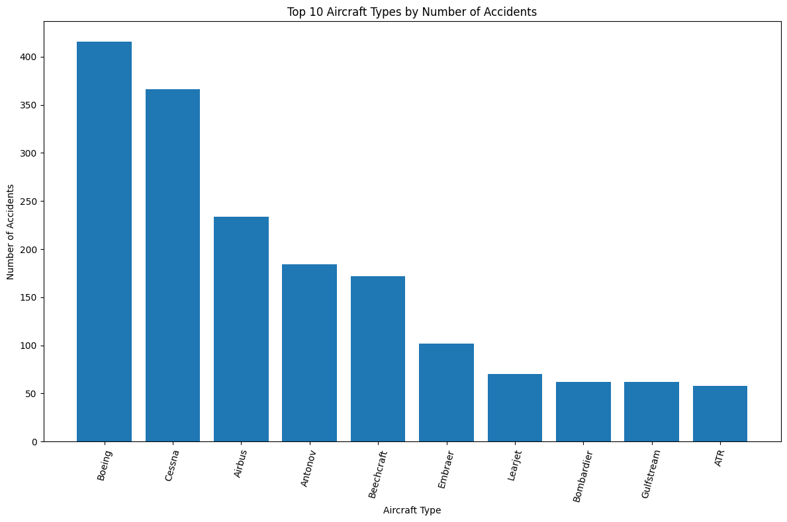
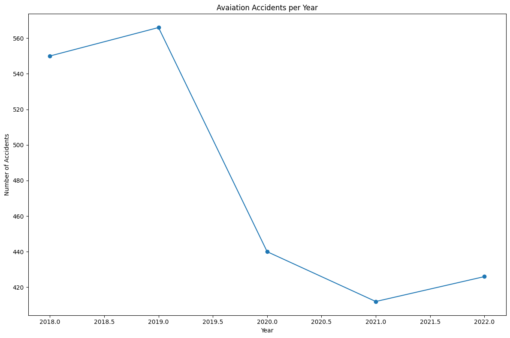
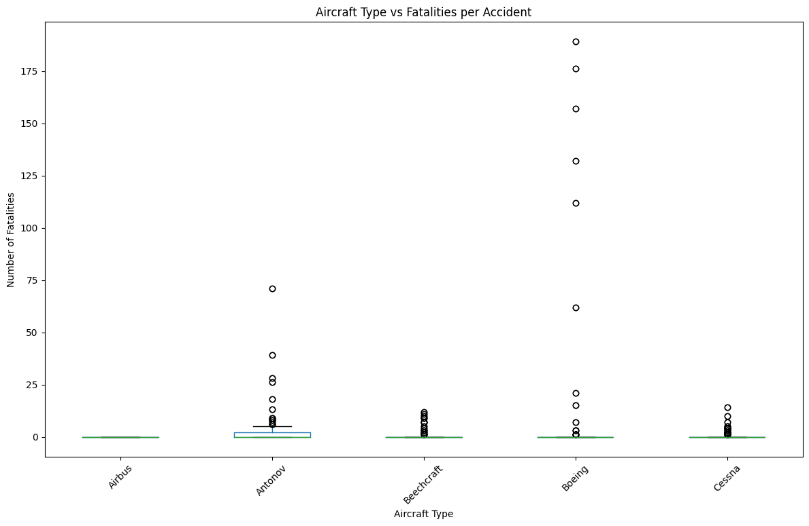
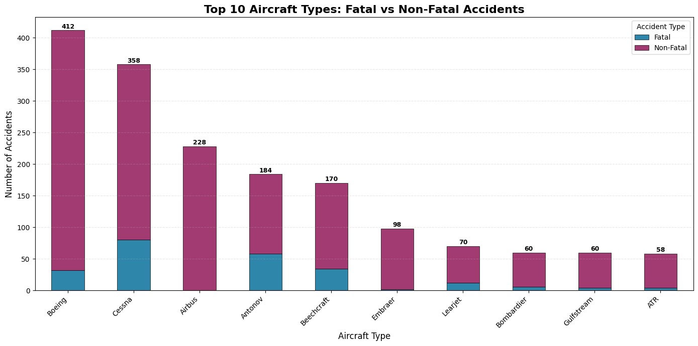

# Data Analysis for Flight Prediction Project

### **Overview** 

This project focuses on analyzing the [Aviation Crashed Flights Data](https://www.kaggle.com/datasets/anandkushawaha/aviation-crashed-flights-data?resource=download)to uncover actionable insights that support data-driven decisions in aircraft procurement and operations. Over the course of this week, I explored the dataset, performed visualizations, and derived conclusions that address key business questions regarding the safety and risk associated with different airplane types.

### **1. Business Understanding**

The primary goal of this project is to assist the company in diversifying its aircraft portfolio by identifying safer airplane types for purchase and operation. By analyzing historical crash data, the company can minimize risk and make informed investment decisions.

- **Stakeholders:**
  - Company Shareholders
  - Procurement Managers
  - Operations and Safety teams
    
- **Key Business Questions:**
  1. Which airplane types have the lowest risk of accidents and fatalities?
  2. Are there specific manufacturers or models associated with higher crash rates?
  3. How do accidents vary across different regions and time periods?

The insights will enable shareholders to select aircraft that optimize safety, reliability, and long-term operational efficiency.

### **2. Data Understanding and Analysis**

**Source of Data**

The datasetis sourced from [Kaggle](https://www.kaggle.com/datasets/anandkushawaha/aviation-crashed-flights-data?resource=download). It contains historical crash data of commercial and private aircraft, spanning from January 2018 to January 2021 and over regions worldwide.

**Description of Data**

Dataset contains:

 - Accident Date (acc.date) : Date of the accident
 - Type: Aircraft model/type
 - Registration (reg): This is a unique identification of the plane
 - Operator: Company operating the aircraft
 - Fatalities (fat): Number of fatalities that occured after the plane crash
 - Location: This is where the plane crash happened geographically 
 - Damages (dmg) : These are the severity of damage caused. This can be substantial, Write-off or No Damage.

Data cleaning included handling missing values, standardizing aircraft type names, and converting date fields to datetime objects for time-series analysis.

**Visualizations**

Here are the 4 key visualizations that highlight important insight:

1. Top 10 Aircraft Types by Crash Count
    - This visualization shows which airplane types have historically experienced the most crashes.
    

2. Aviation Accidents Over Time 
    - Demonstrates how accidents have evolved over the decades, highlighting improvements in safety or identifying high-risk periods.
    

3. Aircraft Type by Fatalities 
    - Displays the total number of fatalities per aircraft type, helping identify higher-risk models.
    

4. Top 10 Aircraft Types: Fatal vs Non-Fatal Accidents
    - Breaks down accidents into fatal and non-fatal categories for the ten most common aircraft types. This helps identify which types are more likely to result in serious outcomes.
    

### **3. Conclusion**

Based on the analysis of aviation accident data from 2018-2022, several key findings emerge:

**Key Findings:**

1. **Highest Risk Aircraft Types:**
   - Boeing and Cessna aircraft dominate accident statistics, with approximately 417 and 365 total accidents respectively
   - However, Boeing shows a notably higher proportion of fatal accidents (roughly 30 fatal out of 417 total) compared to Cessna (approximately 80 fatal out of 365 total)
   - Despite lower total accident counts, Cessna demonstrates a higher fatality rate per accident

2. **Positive Safety Trends:**
   - Aviation accidents have shown a significant declining trend from 2018-2021, dropping from approximately 555 accidents in 2018 to around 412 accidents in 2021
   - A sharp decline occurred between 2019 and 2020, likely influenced by reduced flight operations during the COVID-19 pandemic
   - The sustained lower accident rates in 2021-2022 suggest improved safety measures industry-wide

3. **Fatality Analysis:**
   - Most aircraft types show a concentration of low-fatality incidents, with outliers representing catastrophic events
   - Beechcraft and Cessna show wide distributions in fatalities per accident, indicating inconsistent safety outcomes
   - Airbus, despite having around 228 accidents, shows almost entirely non-fatal outcomes, suggesting superior safety engineering

4. **Lower-Risk Options:**
   - Aircraft types like ATR, Gulfstream, and Bombardier demonstrate significantly fewer total accidents (approximately 58-70 each)
   - Embraer shows a favorable safety profile with 98 accidents, the majority being non-fatal
   - Learjet appears to have the smallest proportion of fatal accidents relative to total incidents

**Recommendations:**

1. **Prioritize for Purchase:**
   - Consider Airbus models for commercial operations due to their exceptional non-fatal accident ratio
   - Embraer and ATR aircraft represent safer alternatives in their respective categories
   - Avoid older Cessna models that show higher fatality rates per accident

2. **Risk Mitigation:**
   - Implement enhanced safety protocols for Boeing aircraft given their high total accident count
   - Invest in modern aircraft models, as the data suggests newer designs correlate with better safety outcomes
   - Focus procurement on manufacturers showing consistent non-fatal accident patterns

3. **Further Investigation Needed:**
   - Analyze accident causes by aircraft type to understand underlying risk factors
   - Examine the relationship between aircraft age and accident severity
   - Investigate regional variations in safety performance to optimize operational routes

**Business Impact:**

By selecting aircraft from manufacturers with proven lower fatality rates (Airbus, Embraer, ATR) and avoiding models with consistently poor safety records, the company can significantly reduce operational risk, protect passenger safety, minimize liability exposure, and enhance corporate reputation in the aviation market.

### For More Information

Please review our full analysis [Juypyter Notebook](https://github.com/MoonwaMasaki/P1-Project/blob/main/project.ipynb) or the [presentation]()

For any additional questions, please contact me [email](moonwaangela@gmail.com)

By selecting aircraft from manufacturers with proven lower fatality rates (Airbus, Embraer, ATR) and avoiding models with consistently poor safety records, the company can significantly reduce operational risk, protect passenger safety, minimize liability exposure, and enhance corporate reputation in the aviation market.
# Project1
